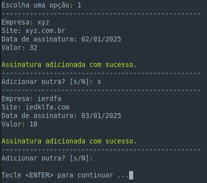

# Gestão de Assinaturas

> Projeto desenvolvido na [PSW 12](https://pythonando.com.br "Pythonando").

## Objetivo

    Gerenciar suas assinaturas de streaming e outras.

## Sumário

- <a href='#pré-requesitos'>Pré-requisitos</a>
- <a href='#funcionalidades'>Funcionalidades</a>
- <a href='#screenshots'>Screenshots</a>
- <a href='#como-executar-o-projeto'>Como executar o projeto</a>

### Pré-requisitos

    Bibliotecas: sqlmodel, matplotlib e rich.

### Funcionalidades

- Cadastro de assinaturas
- Listagem das assinaturas
- Exclusão de assintura
- Pagamento da assinatura
- Lista pagamentos por assinatura
- Excluir pagamento
- Consultar o gasto total com assinaturas
- Gráfico com os gastos dos últimos 12 meses

### Screenshots

| &nbsp;&nbsp;
| &nbsp;&nbsp;
| &nbsp;&nbsp;
| &nbsp;&nbsp;
| &nbsp;&nbsp;

### Como executar o projeto

```bash
# Clone o projeto
git clone https://github.com/gm-costa/gestao_assinaturas.git

# A partir daqui vou usar o comando 'python3', pois uso linux, quem for 
# usar no windows, pode substituir por 'python' ou somente 'py'

# Crie o ambiente virtual
python3 -m venv venv

# Ative o ambiente
    # No Linux
        source venv/bin/activate
    # No Windows
        venv\Scripts\Activate

# Instale as bibliotecas
pip install -r requirements.txt

# Teste o projeto, em um browser digite
python templates/app.py

```

---
